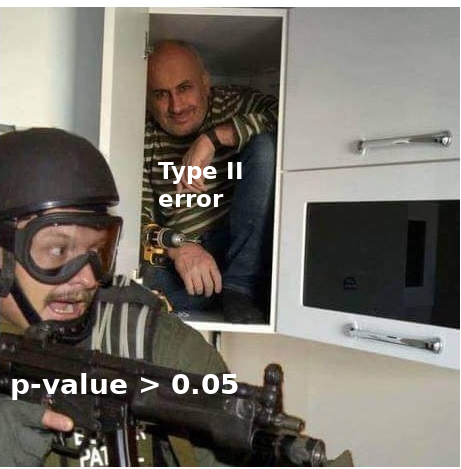

<style>
body {
text-align: justify;
font-size: 12pt}
</style>

```{r setup, include=FALSE}
knitr::opts_chunk$set(echo = TRUE)
```

## 1. Az ESS2018 adatbázis

Tekintsük a Moodle-n található *ESS2018.xlsx* fájlt. Az adatbázis a 2018-ban végzett európai szociális felmérés (European Social Survey 2018 = ESS2018) 1568 magyar kitöltöjének válaszait tartalmazza 12 kérdésre.

Az "NA" kód jelentése: "Nincs adat", tehát ekkor a kitöltő nem válaszolt az adott kérdésre. Az adatbázisban szereplő kitöltők a teljes 18 év feletti magyar népességből vett véletlen mintaként kezelhetők. A teljes adatbázis [innen](https://www.europeansocialsurvey.org/data/download.html?r=9) elérhető.

A 12 kérdésre adott választ értelemszerűen 12 változóban tárolja az adatbázis, amelyek a következők.

- **Oktatas**:	Oktatásban töltött évek száma
- **Hirek**: Hetente politikai hírek fogyasztásával töltött idő (perc)
- **PolitikaErdeklodes**:	Politika iránti érdeklődés szintje
- **Trening	Részvétel**: Részt vett-e továbbképzésen/tréningen az elmúlt évben?
- **PolitikaMagabiztossag**:	Politikai kérdésekben érzett magabiztosság
- **Jovedelem**:	Jövedelmi tized. Pl. 2. tizedben lévő kitöltők jövedelem szerint a 2. legszegényebb 10%-ába tartoznak a magyar népességnek.
- **JovForrasa**:	Jövedelem forrása
- **Gyerekek**:	Gyermekek száma
- **Munkaido**:	Heti munkaidő (óra)
- **Partpref**:	Pártpreferencia
- **Megye**:	Lakóhely megyéje
- **Regio**:	Lakóhely régiója

Töltsük is be az Excel fájlt egy R `data frame`-be a `readxl` csomag segítségével!

Először állítsuk be a `Working Directory`-t:

```{r}
setwd("~/Oktatás 2021221/Többváltozós adatelemzés/R jegyzet")
```

Majd ténylegesen olvassuk is be a fájlt a `read_excel` függvénnyel:

```{r}
library(readxl)
ESS2018 <- read_excel("ESS2018.xlsx")

str(ESS2018)
```

Láthatjuk, hogy megvan mind a 12 változónk a megfelelő adattípusokkal. Bár, észrevehetjük, hogy minden nominális változónk `character` adattípust kapott, ami a `summary` függvénnyel végzett leíró statisztikai elemzések során nem lesz túl informatív.<br>
Mivel minden `character` típusú változónknak az értékkészlete aránylag kicsi és fix (egyiknél sem tartjuk elképzelhetőnek, hogy olyan változatos tartalma lenne, mint mondjuk a kitöltő nevének lenne, ami indokolna tényleg egy `character` adattípust egy `factor` helyett), így érdemes lehet ezeket a változókat `factor` adattípusúvá konvertálni.

```{r}
ESS2018$PolitikaErdeklodes <- as.factor(ESS2018$PolitikaErdeklodes)
ESS2018$Trening <- as.factor(ESS2018$Trening)
ESS2018$PolitikaMagabiztossag <- as.factor(ESS2018$PolitikaMagabiztossag)
ESS2018$Jovedelem <- as.factor(ESS2018$Jovedelem)
ESS2018$JovForrasa <- as.factor(ESS2018$JovForrasa)
ESS2018$Partpref <- as.factor(ESS2018$Partpref)
ESS2018$Megye <- as.factor(ESS2018$Megye)
ESS2018$Regio <- as.factor(ESS2018$Regio)

str(ESS2018)
```

Remek, úgy néz ki, hogy ezzel megvagyunk! Láthatjuk, hogy a `factor` adattípusú nominális változókra az `factor` függvény eredménye mutatja az értékkészlet méretét, azaz a változó *szintjeinek* (in inglis *levels*) számát. Láthatjuk tehát, hogy megyéből a várakozásoknak megelelően 20 db van (19 rendes megye + Budapest).

Akkor hát, ismétlés gyanánt nézzünk pár leíró statisztikai elemzést az adatbázison!

## 2. Minta vs Sokaság

Vizsgáljuk meg a hírfogyasztással töltött idő, azaz a **Hirek** változó átlagát, szórását és mediánját, valamint a **Partpref** változó alapján a Fidesz támogatottsági arányát.<br>
A szórást most számoljuk az R beépített `sd` függvényével, ami a nevezőben $N-1$-gyel oszt. Ennek okára rövidesen kitérünk.

```{r}
# Hírfogyasztási idő vizsgálata
mean(ESS2018$Hirek)
sd(ESS2018$Hirek)
median(ESS2018$Hirek)
max(ESS2018$Hirek)

# Fidesz támogatottsági arányának meghatározása a relatív gyakoriságok segítségével
prop.table(table(ESS2018$Partpref))
```

Értelmezzük az eredményeket:

- A kérdőív egy átlagos kitöltője hetente $124$ percet tölt hírfogyasztással, amitől egy konkrét kitöltő egyéni hírfogyazstási ideje várhatóan $\pm 243$ perccel térhet el. Az átlag majdnem kétszeresét kitevő hatalmas szórás arról árulkodik, hogy van az 1568 kitöltő között pár outlier hírfogyasztási szokással rendelkező egyén.
- Az outlierek jelenlétét megerősíti, hogy a medián hírfogyasztási idő $30$ perc hetente. Tehát a kitöltők fele legfeljebb 30 percnyi hírt fogyaszt hetente. Azaz, van a mintában pár kitöltő, akik minden idejük a héten hírnézéssel/olvasással töltik. Mint pl. a maximális, 1122-vel bíró ürge. :)
- A pártpreferincia alapján az látható, hogy a kitöltők $23.7\%$-a Fidest támogató. A Fidesz a legnagyobb támogatottsággal bíró párt, de a legnagyobb arányban (kb. 61%-ban) azok vannak jelen a mintában, akik nem adták meg pártpreferenciájukat.

A fenti értelmezések során azt kell észbentartani, hogy az 1568 megfigyelést tartalmazó **adatsorunk csupám egy minta, azaz részhalmaz a teljes magyar népességből**! Az eddig tanult **leíró statisztikai mutatószámaink** viszont **azt gondolják, hogy ez az adatsor a teljes sokaságunk** egyben! Tehát, az eddig tanult mutatóink mindig csak a **megfigyelt adatok körében adnak értelmezhető eredményeket**. **NEM mondanak semmit a megfigyeléseinken túli világról**, mert azt hiszik, amit látnak az a teljes **sokaság**.<br>
Tehát a statisztikai mutatók értelmezésénél okkal fogalmaztam úgy, hogy a medián, átlag, szórás és a pártpreferencia alapján számolt relatív gyakoriságok csupán az **1568 kitöltőben lévő információt mutatják meg, a megfigyeléseken túli világról, a magyar népesség egészéről ÖNMAGUKBAN nem árulnak el információt**!

Ugyanakkor, **egy mintából számolt statisztikai mutatóból meg lehet becsülni a mutató valós, sokasági értékét, ha és amennyiben a minta véletlen kiválasztással született**. Tehát, ha a mintavétel véletlen módon történt, akkor tudok valamit majd mondani a magyar népesség átlagos hírfogyasztási idejére abból, hogy a megfigyelt 1568 emberkém átlagosan heti 124 percet tölt hírfogyasztással.<br>
A véletlen mintavétel itt azt jelenti, hogy **van egy listám a teljes magyar népességről, és onnan egy véletlenszám-generátor segítségével sorsolok mondjuk 1568 embert, aki be fog kerülni a mintámba**. Tehát azt kell biztosítani a véletlen mintavétel során, hogy *úgy kerüljenek megfigyelési egységek a mintámba, mint ahogy kihúzzák a lottószámokat*.<br>
Ebben az esetben a mintavételem **reprezentatív** lesz minden változóra. Ez azt jelenti, hogy **ha veszek egy tetszőleges változót, pl. az iskolai végzettséget, akkor a mintámban lévő emberek körében a különböző végzettségi szintek aránya kb. ugyan annyi, mint a teljes adatsokaságban a végzettségi szintek aránya**. Tehát, ha pl. a teljes magyar népesség 20%-a végzett legfeljebb 8 általánost, akkor a mintaelemeknek is kb. 20%-a legyen legfeljebb 8 általánost végzett. Vagy, ha a budapesti lakásárakat akarom mintavétel alapján vizsgálni úgy, hogy mondjuk a kerületekre reprezentatív legyen a minta, akkor az azt jelenti, hogy az összes budapesti lakás pl. 34%-a van az V. kerületben, akkor a mintámba kerülő lakásoknak is kb. 34%-a kell, hogy az V. kerületben legyen.<br>
Szerencsére, mint fentebb írtam: a véletlenszám-generátor segítségével működő, sorsolás alapú véletlen mintavétel minden változóra biztosítja a reprezentativitást. Rövidesen látni is fogjuk miért.

Azonban a **szubjektív véletlen elven működő**, azaz a "*megyek random valamerre és random embereket megkérdezek*" típusú, **mintavételek NEM biztosítják automatikusan a fenti bekezdésben leírt reprezentativitást**!<br>
Ez teljesen logikus: ha az én **szubjektív véletlenemre van bízva, hogy kit kérdezek meg, akkor nyilvánvalóan felülreprezentálva lesznek a mintában a számomra szimpatikus elemek**. Ha random embereket kell megkérdeznem, és nekem szimpatikusak a vörös hajú lányok, akkor értelemszerűen belőlük többet fogok megkérdezni, mint kellene. Vagy ha a budapesti lakások példéjánál maradok, akkor ha a mintavétel az én szubjektív véletlenemre van bízva, akkor a számomra szimpatikus környékeken lévő lakások értelemszerűen felülreprezentáltak lesznek a valós sokasági arányukhoz képest!

**Azzal, hogyan kell a gyakorlatban ilyen sorsolás alapú véletlen mintákat venni, itt nem foglalkozunk**, mivel a kérdés elég bonyolult, [komplett mesterszakok](https://tatk.elte.hu/mesterszakok/survey) foglakoznak csak ezzel.<br>
Mindig csak **feltesszük, hogy a mintavételes adatsoraink sorsolás alapú véletlen mintaként kezelhetők**. Az **ESS2018 adatbázsiról az EU ezt mondja, szóval most jobb híján ezt elhisszük nekik**.<br>
Egyébként amiről élből látni lehet, hogy nem véletlen mintavétel elvén kapott adatok, azok az idősoros adatok! Mivel a véletlen mintavétel során igaz az, hogy minden megfigyelési egységünk egymástól függetlenül került kiválasztásra. Viszont, ha mondjuk egy ember jövedelmének alakulását nézzük több időpontban egy adatbázsiban, akkor az biztos nem független adatkiválasztás.  Hiszen az, hogy mi volt mondjuk egy ember jövedelme 2020-ban az nem független attól, hogy mi volt a jövedelme 2019-ben. **Emiatt a most következő módszerek, amiket tanulunk idősoros adatokon NEM alkalmazhatók!**

## 3. Konfidencia intervallumok

No, akkor ha el tudjuk fogadni, hogy a vizsgált adatbázisunk egy **véletlen minta valamilyen adatsokaságból**, akkor **van esélyünk arra, hogy a mintából számolt statisztikai mutatók alapján becslést tudjunk adni a mutatószámok valós, sokasági értékére**. Ennek a **becslésnek az eszköze az úgynevezett konfidencia-intervallumok számítása**.

Egy **statisztikai mutatószám konfidencia-intervalluma megadja egy mintavétel alapján, hogy mi az az értéktartomány, amiben a mutatószám valós, teljes adatsokaságban mért értéke egy jó valószínűséggel benne van**. Ezt a "*jó valószínűséget*" hívjuk a konfidencia-intervallum **megbízhatósági szint**jének. Tehát, ha azt mondanám, hogy a magyar munkavállalók havi bruttó átlagvfizetésének 95%-os megbízhatósági szintű konfidencia-intervalluma $[380;410]$ ezer Ft, akkor az azt jelenti, hogy a magyar munkavállalók *havi bruttó átlagfizetése 95%-os valószínűséggel valahol 380-410 ezer Ft körül lehet*.<br>
Értelemszerűen ilyen jelentéstartalommal bíró **konfidencia-intervalluma bármilyen statisztikai mutatónak**, így pl. mediánnak, szórásnak és aránynak is **van**.

Ahhoz, hogy a **konfidencia-intervallum számítható legyen egy minta adataiból 2 előfeltétel**nek **kell** teljesülnie:

- A **minta kiválasztási módja** legyen rendes, sorsolás alapú **véletlen**.
- A statisztikai mutató legyen **torzítatlanul becsülhető**.

A 2. feltétel, a **torzítatlanság azt jelenti, hogy egy mintából számolt statisztikai mutató értéke ugyan olyan valószínűséggel essen a mutató valós, sokasági értéke alá, mint fölé**.<br>
Ezt a **feltételt az átlagok, arányok és mediánok alapból tudják, de a szórás NEM**!<br>
**A sima,** $\sigma=\sqrt{\frac{\sum_{i=1}^N{Y_i-\bar{Y}}}{N}}$ **képlettel mintából számolt szórások valószínűbb, hogy kisebbek a valós, sokasági szórásnál, mint hogy nagyobbak**! Magyarul, ha az adataink egy mintát képviselnek, nem pedig egy teljeskörű adatsokaságot, akkor a szórás értéke a valós szórás értékénél jó eséllyel kisebb. Tehát, alapjáraton **egy mintából számolt szórás a valós szórást konzisztensen alulbecsli**.<br>
Ellenben az $s=\sqrt{\frac{\sum_{i=1}^N{Y_i-\bar{Y}}}{N-1}}$ **képlettel számolt korrigált mintaszórások már torzítatlanul becslik a valós szórást, tehát ugyan olyan értékkel lehetnek a valós érték felett, mint alatt**. Tehát a képlet nevezőjének csökkentésével, a teljes törtet meg lehet növelni annyival, hogy a valós szórás konzisztens alulbecslését orvosoljuk. **Az R `sd` függvénye pedig épp ezt a korrigált szórást számolja**!

Na, akkor már tudjuk milyen módon elégíthető ki a szórás esetén is a torzítatlan becslés előfeltétele, és ezzel meg is fejtettük, hogy miért $N-1$-gyel oszt az R `sd` szórást számító függvénye.<br>
Akkor lássuk hát hogyan lehet **konfidencia-intervallumokat számítani**!

Általánosságban egy statisztikai mutató konfidencia-intervalluma úgy működik, hogy **fogom a mutató mintából számolt értékét, és erre rámérek egy** $\pm \triangle$ **értéket**, ami a **konfidencia-intervallum hossza, vagyis a becslés pontossága**.<br>
Ez a $\triangle$ érték **két tényező** szorzataként jön ki: **egy standard mintavételi hiba** és **egy megbízhatósági tényező** szorzataként.

- A **standard mintavételi hiba, vagy röviden csak standard hiba**, $SH$ **megadja, hogy egy mintából számolt statisztikai mutató értéke várhatóan mennyivel tér el a mutató valós sokasági értékétől**.
- Míg az általában $k$**-val jelölt korrekciós tényező mértéke a konfidencia-intervallum megbízhatósági szintjét**.

Tehát, $\triangle = SH \times k$. És ezt kell rámérni $\pm$ a mutató mintából számolt értékére.

### 3.1. Az átlag konfidencia-intervalluma

Átlag esetén a $\triangle = SH \times k$ két tényezője a következőképpen számolható.

- $SH=\frac{s}{\sqrt{N}}$: Tehát a minta korrigált szórását kell osztani az elemszám gyökével.
- A $k$ megadására az egyes megbízhatósági szintekhez komolyabb valószínűségszámítási ismeretek szükségesek, amelyekbe sajnos jelen kurzus esetén nincs időnk belemenni. Ugyanakkor, átlag esetén általánosan elmondhatók $k$ értékéről az alábbiak.
  * $90\%$-os megbízhatóság esetén $k=1.6$
  * $95\%$-os megbízhatóság esetén $k=2.0$
  * $99\%$-os megbízhatóság esetén $k=2.6$

Tehát, ha az ESS2018 adatbázist egy **1568 elemű véletlen mintaként tekintjük a magyar népességből, akkor az átlagos hírfogyasztási idő 95%-os megbízhatóságú konfidencia-intervallumát a magyar népesség egészére a következőképpen számoljuk**:

```{r}
# Hírfogyasztási idő 95%-os konfidencia-intervalluma
mintaatlag <- mean(ESS2018$Hirek)
s <- sd(ESS2018$Hirek)
N <- nrow(ESS2018) # a data frame sorainak száma = elemszám
k <- 2 # mert 95%-os a megbízhatóság

# Átlag hírnézési idő alsó határ
mintaatlag - s/sqrt(N) * k
# Átlag hírnézési idő felső határ
mintaatlag + s/sqrt(N) * k
```

Az eredményünk alapján elmondható, hogy **a teljes magyar népességben az átlagos heti hírfogyasztási idő 95%-os valószínűséggel 112 és 137 perc között van**.

Amit érdemes megfigyelni a képlet működésében az két dolog:

- Ha nő az $N$ elemszám, akkor $\triangle = SH \times k$ csökken, hiszen $SH$ csökken. Tehát **logikus módon a mintaelemszám növelése csökkenti a konfidencia-intervallum hosszát, azaz pontosabb lesz a becslés a valós sokasági átlagra**. Ezért nem jók a kis minták: túl pontatlanul becsülhető meg belőlük egy statisztikai mutató értéke.
- Ha nő a megbízhatósági szint, akkor nő a $k$ szorzó értéke, így a $\triangle = SH \times k$ csökken. Azaz, **a megíbzhatósági szint növelése növeli a konfidencia-intervallum hosszát, azaz pontatlanabb lesz a becslés**.

Emiatt a megbízhatósági szintet általában a minta elemszáma alapján választjuk meg: **ha nagy mintánk van megengedhetünk egy 99%-os megbízhatóságot, mert nem lesz tőle túl tág a konfidencia-intervallum. Ellenben, kisebb mintaméret esetén nem engedhetünk meg magunknak nagyobb $k$-t követelő megbízhatósági szintet, mert az $SH$ túl magas**.<br>
Plusz, az eddigiek alapján logikusan következik, hogy a $100\%$-os megbízhatóságú konfidencia-intervallum csak az elég használhatatlan $\pm \infty$ lehet.

**A fenti 2 tulajdonságot nagyon jegyezzük meg, mert ez nem csak az átlag, hanem MINDEN statisztikai mutató konfidencia-intervallumára igaz!**

Nézzük meg, hogyan lehet az átlag konfidencia-intervallumát beépített R függvénnyel számítani. Ehhez először is szükségünk van az `rcompanion` csomag telepítésére és behivatkozására a `library` függvénnyel:

```{r eval=FALSE}
install.packages("rcompanion")
library(rcompanion) # Szokásos módon ne törődjünk az esetleges Warningokkal! :)
```
```{r echo=FALSE}
library(rcompanion)
```

A csomag `groupwiseMean` függvényével a fenti 112 és 137 perc közötti konfidencia-intervallum az átlagos heti hírnézésési időre kiszámítható:

```{r}
groupwiseMean(Hirek ~ 1, # a "~ 1" azt jelenti, hogy a konfidencia-intervallumot a teljes Hirek változóra akarjuk számolni
              data   = ESS2018, # a számításhoz használt data frame neve
              conf   = 0.95, # kívánt megbízhatósági szint
              digits = 3) # az eredményeket 3 tizedesjegyre kerekítve jeleníti meg
```

Nagyon jó, megvan kb. a 112 - 137 perc közötti konfidencia-intervallum! :) A felső határnál azért kerekít máshogy, mert a 95%-os megbízhatósághoz tartozó 2 szorzó valójában 1.95996, de nem akartam ennyire precíz lenni. :)

A függvénnyel könnyen számolható akármilyen megbízhatósági szintú konfidencia-intervallum megadható. Pl. egy 97%-os is:

```{r}
groupwiseMean(Hirek ~ 1,
              data   = ESS2018,
              conf   = 0.97,
              digits = 3)
```

Láthatjuk is, hogy az átlagos heti hírnézési időre adott konfidencia-intervallum 112-136 percről 111-138 percre tágul. Tehát tapasztaljuk, amit megállapítottunk korábban: a megbízhatósági szint növelésével pontatlanabb lesz a becslés, ha nem nő a mintánk elemszáma.

A `groupwiseMean` függvény segítségével **egy numerikus változó átlagára épített konfidencia-intervallum megadható egy nominális változó értékei szerint megbontva is**. Pl. vizsgáljuk meg a gyermekek száma változó 95%-os megbízhatóságú konfidencia-intervallumának alakulását megyénként:

```{r}
groupwiseMean(Gyerekek ~ Megye, # a "~ Megye" azt jelenti, hogy a konfidencia-intervallumot megyénként akarjuk számolni
              data   = ESS2018,
              conf   = 0.95,
              digits = 3)
```

Az eredmény tanulmányozása érdekes következtetésekkel szolgál. Ha **csak a mintában mért átlagos gyerekszámot nézzük, akkor azt mondanánk, hogy átlagos gyerekszám Budapesten a legalacsonyabb**.<br>
Ellenben, ha **a teljes népességre vonatkoztatva akarjuk értelmezni az eredményeket**, nem csak a megfigyelt 1568 kitöltőre, akkor **a konfidencia-intervallum alsó határa alapján a legalacsonyabb átlagos gyermekszám a teljes népességet tekintve Heves megyében található**. Ez ugyebár annak tudható be, hogy **Budapest 0.938-as átlagos gyerekszámát 194 elemű mintából** számoltuk, míg **Heves megye 0,943-as átlaga csak 35 elemű mintából** adódik, így ott a 95%-os megbízhatóságú konfidencia-intervallum alapján simán elképzelhető, hogy a *valós, teljes népességben mért* átlagos gyerekszám csak $0.643$. Ellenben, a nagyobb elemszámú mintával bíró Budapesten a szintén 95%-os megbízhatóságú konfidencia-intervallum szerint a legkisebb szóba jöhető átlag a teljes népességben már $0.805$.

Az eredményeket egy feltételes formázással ellátott Excel táblába is kiexportálhatjuk az `openxlsx` csomag segítségével.

Telepítsük és hivatkozzuk be a csomagot:

```{r eval=FALSE}
install.packages("openxlsx")
library(openxlsx) # Szokásos módon ne törődjünk az esetleges Warningokkal! :)
```
```{r echo=FALSE}
library(openxlsx)
```

Majd mentsük el a konfidencia-intervallumokat tartalmazó táblát, és hajtsuk végre a feltételes formázással megtámogatott Excel exportot:

```{r}
# intervallumok mentése
KonfInt <- groupwiseMean(Gyerekek ~ Megye,
              data   = ESS2018,
              conf   = 0.95,
              digits = 3)

# Excel fájl létrehozása
wb <- createWorkbook()

# Cél munkalap létrehozása
addWorksheet(wb, "Gyerekszám Megyénként")

# Elmentett intervallumok kiírása a munkalapra az A1 cellától kezdve
writeData(wb, "Gyerekszám Megyénként", KonfInt)

# Feltételes formázás a mintaátlagokra
conditionalFormatting(wb, "Gyerekszám Megyénként",
                        cols = 3, rows = (2:(nrow(KonfInt)+1)), # a data frame Mean (azaz 3.) oszlopára és a 2-től kezdve az összes sorára vonatkozzon a formázás
                        style = c("red", "white", "green"), # színskála-átmenet megadása
                        rule = NULL,
                        type = "colourScale")

# Feltételes formázás a konfidencia-intervallum alsó határaira
conditionalFormatting(wb, "Gyerekszám Megyénként",
                        cols = 5, rows = (2:(nrow(KonfInt)+1)), # a data frame Trad.lower (azaz 5.) oszlopára és a 2-től kezdve az összes sorára vonatkozzon a formázás
                        style = c("red", "white", "green"), # színskála-átmenet megadása
                        rule = NULL,
                        type = "colourScale")

#Excel fájl elmentése: a beállított Working Directory-ba rakja majd az eredményt
saveWorkbook(wb, "GyerekszamMegye.xlsx", overwrite = TRUE)
```

Az eredményünk egy ilyen szépen formázott Excel tábla:

<center>
{width=45%}
</center>

### 3.2. Az arányok konfidencia-intervalluma

Na, akkor próbáljunk mondjuk valami **99%-os megbízhatóságú konfidencia-intervallum**ot építeni a **Fideszt támogatók arányára** is.<br>
Szerencsére ezt aránylag könnyű megtenni, hiszen **egy adott tulajdonsággal bíró egyedek aránya lényegében egy átlag**! Konkrétan **egy olyan változó átlaga, ahol a tulajdonsággal bíró egyedek $1$ értéket, míg a tulajdonsággal NEM rendelkező egyedek $0$ értéket kapnak**.

Ezt könnyű is szemléltetni R-ben. Vegyük ismét a **Partpref** változó relatív gyakoriságait:

```{r}
prop.table(table(ESS2018$Partpref))
```

Ez alapján ugye a Fidesz támogatóinak aránya a megfigyelt 1568 elemű mintában $23.7\%$. Ezt az eredmányt pedig úgy is meghakpahtjuk, hogy csinálunk egy új **Fidesz** nevű változót az **ESS2018** `data frame`-be, amiben a Fidesz támogatók $1$ értéket kapnak, a többiek $0$-t, és vesszük az új változó átlagát:

```{r}
# Létrhozzuk a Fidesz nevű változót, ahol kezdetben mindenki 0 értéket kap
ESS2018$Fidesz <- 0

# Majd a Fidesz támogatókat fellülírjuk egy 1-es értékkel
ESS2018$Fidesz[ESS2018$Partpref=="Fidesz-KDNP"] <- 1

# És vesszük az új változó átlagát
mean(ESS2018$Fidesz)
```

Ismét megkaptuk a $23.7\%$-os támogatottsági arányt. Ez alapján pedig könnyen elkészíthetjük rá a 99%-os megíbzhatóságú konfidencia-intervallumot a `groupwiseMean` függvénnyel:

```{r}
groupwiseMean(Fidesz ~ 1,
              data   = ESS2018,
              conf   = 0.99,
              digits = 3)
```

Tehát, a mintánk alapján a **magyar népesség egészét tekintve az mondható el, hogy 99%-os valószínűséggel legalább $21\%$-uk támogatja a Fidesz-KDNP-t, viszont szintén 99%-os valószínűséggel kijelenthető, hogy a támogatottsági arányuk nem magasabb $26.5\%$-nál**.

A teljes népességre nézve vett Fidesz támogatottság vizsgálható a `groupwiseMean` függvénnyel regionális bontásban is:

```{r}
groupwiseMean(Fidesz ~ Regio,
              data   = ESS2018,
              conf   = 0.99,
              digits = 3)
```

Látható, hogy a mintán belül a Fidesz támogatottsága az Dél-Dunántúlon a legkisebb (17.9%), ám ha a konfidencia-intervallum segítségével a teljes népességet vizsgáljuk, és a Fidesz-szempontjából optimista forgatókönyvet, tehát az intervallum felső határát tekintjük akkor már a Dél-Dunántúl teljes népességben elképzelhető legnagyobb támogatottsági aránya a Nyugat-Dunántúl és az Észak-Alföld értékét is megelőzi! Mivel a Dél-Dunántúl aránya 95 elemű mintából számított, de a másik két régióban magasabb az elemszám, így e két régióban a relatíve alacsony mintában mért támogatottsági arány egy pontosabb mérésnek vehető a teljes népességből, mint a Dél-Dunántúl mintában mért támogatottsági aránya.

Az eredményeket ugyan úgy, mint a gyerekszám megye szerinti megbontása esetén feltételes formázással ellátva is Excelbe Exportálhatjuk:


```{r}
# intervallumok mentése
KonfInt <- groupwiseMean(Fidesz ~ Regio,
              data   = ESS2018,
              conf   = 0.99,
              digits = 3)

# Excel fájl létrehozása
wb <- createWorkbook()

# Cél munkalap létrehozása
addWorksheet(wb, "Fidesz támogatottság")

# Elmentett intervallumok kiírása a munkalapra az A1 cellától kezdve
writeData(wb, "Fidesz támogatottság", KonfInt)

# Feltételes formázás a mintaátlagokra
conditionalFormatting(wb, "Fidesz támogatottság",
                        cols = 3, rows = (2:(nrow(KonfInt)+1)), # a data frame Mean (azaz 3.) oszlopára és a 2-től kezdve az összes sorára vonatkozzon a formázás
                        style = c("red", "white", "green"), # színskála-átmenet megadása
                        rule = NULL,
                        type = "colourScale")

# Feltételes formázás a konfidencia-intervallum alsó határaira
conditionalFormatting(wb, "Fidesz támogatottság",
                        cols = 6, rows = (2:(nrow(KonfInt)+1)), # a data frame Trad.upper (azaz 6.) oszlopára és a 2-től kezdve az összes sorára vonatkozzon a formázás
                        style = c("red", "white", "green"), # színskála-átmenet megadása
                        rule = NULL,
                        type = "colourScale")

#Excel fájl elmentése: a beállított Working Directory-ba rakja majd az eredményt
saveWorkbook(wb, "FideszTamog.xlsx", overwrite = TRUE)
```

Az eredményünk egy ilyen szépen formázott Excel tábla:

<center>
{width=50%}
</center>

Érdemes az arány konfidencia-intervallumának számítása során felhasználni azt az információt, hogy egy csak 0-ból és 1-ből álló változó korrigált mintaszórása $s=\sqrt{p(1-p)}$ módon számítható, ahol $p$ az $1$ értékek aránya a mintában!<br>
Nézzük is meg, hogy igaz-e ez! Ugyebár a Fidesz támogatottsági aránya a teljes 1568 elemű mintában $p=23.7\%$. Ez alapján a szórása a **Fidesz** nevű 0-1-ből álló változónak $s=\sqrt{p(1-p)}=\sqrt{0.237 \times (1-0.237)}=0.4252$.

Nézzük meg az eredményt az R `sd` függvényével is:

```{r}
sd(ESS2018$Fidesz)
```

A kétféleképp számolt érték némi kerekítési hibát leszámítva egyezik! :)

Ez azt jelenti, hogy **az arány konfidencia-intervallumának hossza** a $\triangle = SH \times k$ képlet alapján $\sqrt{\frac{p(1-p)}{N}} \times k$ módon számítható, hiszen az átlag standard hibája $\frac{s}{\sqrt{N}}$ volt, és most felhasználtuk, hogy csak 0-1-et tartalmazó változókra $s=\sqrt{p(1-p)}$. A $k$ megbízhatósági szorzó pedig $90\%$, $90\%$ és $90\%$ megbízhatósági szint esetén ugyan úgy $1.6$, $2.0$ és $2.6$, mint az átlag kofnidencia-intervallumánál volt.

**Ennyi információ alapján pedig képesek vagyunk arra, hogy még mintavétel ELŐTT meghatározzuk, hogy az arány egy adott pontosságú és megbízhatóságú becsléséhez mekkora elemszámú mintára van szükségünk**.

Ugyebár, a jelenlegi 1568 elemű mintánk esetén Fidesz támogatottsági aránya $p=23.7\%$, **amitől a támogatottsági arány valós sokasági értéke** 99%-os valószínűséggel $\pm$ **2.8 százalékpontos hibahatárral térhet el**: $$\pm \triangle = SH \times k = \sqrt{\frac{p(1-p)}{N}} \times k = \sqrt{\frac{0.237 \times (1-0.237)}{1568}} \times 2.6=0.0279$$

De mi a helyzet, ha a **hibahatár értékét 1 százalékpontra akarom csökkenteni és meg akarom őrizni a 99%-os megízhatósági szintet**? Ekkor **nagyobb mintát kell venni, kérdés, hogy mennyivel nagyobbat**. Ezek alapján a kívánt $\triangle$ érték $0.01$ és a $k=2.6$ értékből sem akarok engedi. Azaz: $$0.01 = \sqrt{\frac{p(1-p)}{N}} \times 2.6$$

Ebből $N$-t kifejezve: $$N=\frac{2.6^2 \times p(1-p)}{0.01^2}$$

Ezen a ponton nagy a csábítás, hogy a képletből úgy számoljuk ki $N-t$, hogy $p=23.7\%$-kal dolgozzunk. De ezt **ne tegyük**! Mivel nem tudjuk, hogy a megnövelt elemszámú mintában mennyi is lesz $p$. Plusz, ha a **szükséges mintaelemszámot AZELŐTT akarjuk meghatározni, hogy a kérdéses $p$ arány becslésére már vettünk mintát, akkor aztán tényleg lövésünk nincs a $p$ értékéről**!

Szerencsére, **rájöhetünk, hogy a $p(1-p)$ kifejezésnek könnyen meg tudjuk adni a maximumát**, hiszen az $f(p)=p(1-p)=p-p^2$ függvény egy fordította parabola, melynek maximuma $p=0.5$-nél kerül felvételre és értéke $max(p(1-p))=0.25$:

<center>
{width=50%}
</center>

Szóval az $N=\frac{2.6^2 \times p(1-p)}{0.01^2}$ formulába **mindig beírhatjuk a $0.25$-öt, hiszen ez a legrosszabb szituációnk, ekkor lesz aránybecslés esetén maximális a standard hibánk**. Ha elégség nagy mintát veszünk, hogy a maximális $SH$ mellett is $\triangle = 0.01$-et érjünk el, akkor minden egyéb esetben is jók vagyunk.

Tehát, **az 1 százalékpontos hibahatár eléréséhez szükséges elemszám 99%-os megbízhatóság mellett** $N=\frac{2.6^2 \times 0.25}{0.01^2}=16900$ **fő**.<br>
Ennek fényében különsöen érdekes meglesni [ezen a linken](https://ig.ft.com/sites/brexit-polling/) hogy hány fős mintából dolgoztak a 2016-os Brexit népszavazás eredményének előrejelzése során a közvéleménykutatók, ahol lehetett tudni, hogy nagyon kiélezett a verseny a maradás és elszakadás pártok között, így a két párt támogatottsági arányának becslése során **nagyon szükség lett volna erre az 1 százalékpontos hibahatárra és a 99%-os megbízhatósági szintre, ami a 16900 elemű minták biztosítanak arányok becslése során**.

További érdekes példaként vegyük a Momentum Mozgalom 2021. október 11-én megosztott plakátját:

<center>
{width=45%}
</center>

Ha megnézzük a kép jobb alsó sarkát láthatjuk, hogy az adatok forrása a Medián közvélemény kutató intézet. A dátum alapján rájöhetünk, hogy [erről a Medián közvéleménykutatásról szól a plakát](https://hvg.hu/itthon/20211011_Median_MarkiZay_elonyhoz_juttathatja_az_ellenzeket). A linkelt HVG cikkből megtudhatjuk, hogy a Medián közvéleménykutatása egy $N=1000$ elemű véletlen mintát takar. Ebben az esetben számoljuk ki a különböző pártlistát támogatottsági arányaihoz a maximális $\triangle$ hibahatárt, azaz vegyük $p(1-p)$-t $0.25$-nek:$$\pm \triangle = SH \times k = \sqrt{\frac{p(1-p)}{N}} \times k = \sqrt{\frac{0.25}{1000}} \times 2.6=0.0411$$

Tehát a hibahatár durván **4 százalékpont**. Ha ezt az értéket Dobrev Klára esetén levonjuk a Fidesz támmogatottsági arányából és hozzáadjuk az Ellenzék témogatottsági arányához, majd ha MZP esetén az Ellenzéki arányból levonjuk és a Fideszhez hozzáadjuk, akkor láthatjuk, hogy **a plakáton kimutatott Fidesz és Ellenzéki pártlisták támogatottsági arányai közötti különbség MZP és Dobrev esetén is bőven a mintavételi hibahatáron belül van**!<br>
Tehát, egyik esetben sem mondható el a konfidencia-intervallum alapján, hogy a teljes népességben reális lenne a plakát állítása, miszerint csak MZP-vel verhető a Fidesz. Az **plakát üzenete csak a megfigyelt 100 elemű mintán belül vehető igaznak**!

### 3.3. A medián konfidencia-intervalluma

Mivel azt néztük az előző tananyagban, hogy olyan kilógó értékekkel rendelkező változók esetén, mint amilyen az ESS2018 adatbázisában a hírek fogyasztásával töltött idő, azaz a **Hirek** változó, a medián egy megbízhatóbb statisztikai mutató az átlagnál, hiszen nem érzékeny a kilógó értékekre.<br>
Ebből adódóan jó lenne konfidencia-intervallumot számítani a mediánra is. Ezt meg is tudjuk tenni a `groupwiseMedian` függvénnyel, ami szintén az `rcompanion` csomagban lakik.

Azonban, a medián konfidencia-intervallumára nincs jól működő, szép formula, így azt csak **szimulációk segítségével lehet meghatározni**. Emiatt a `groupwiseMedian` függvénynek több paramétere van, mint a `groupwiseMean`-nek. A `percentile = TRUE` és `bca = FALSE` beállításokat nyugodtan hagyhatjuk a helyükön. Az `R = 10000` beállítás viszont azt mondja meg a gépállatnak, hogy a konfidencia-intervallumot 10000 szimuláció alapján számítsa ki. Ez egy elég stabil számítást eredményez, de néha túl lassú lehet. Így, ha rövidíteni akarunka  futásidőn, akkor érdemes lehet lejjebb venni az `R` paraméter értékét. De vegyük nagyon le (1000 alá semmiképp), mert ha kevesebb szimulációból számolja gépünk a konfidencia-intervallumot, akkor az kevésbé lesz stabil az eredmény (értsd: újrafuttatás után könnyen lehet, hogy más eredményt kapunk). Egyébként a `groupwiseMedian` függvény teljesen hasonlóan működik, mint a `groupwiseMean`.

Ennyi előzetes megfontolás után akkor nézzük meg, hogy alakul a **Hirek** változó mediánjának 95%-os konfidencia-intervalluma a válaszodók elsődleges jövdelemi forrása szerint:

```{r}
groupwiseMedian(Hirek ~ JovForrasa,
                data = ESS2018,
                conf = 0.95,
                R = 10000,
                percentile = TRUE,
                bca = FALSE,
                digits = 3)
```

Láthatjuk, hogy a mintában a mezőgazdasági egyéni vállalkozók fele legalább 55 percet tölt hetene politikai hírek fogyasztásával, míg az egyéb szociális segélyen élők fele csak legalább heti 30 percet. Azonban, ha a 95%-os konfidencia-intervallummal **a teljes népességben mérhető mediánok lehetséges legnagyobb értékét vizsgáljuk, akkor azt mondhatjuk, hogy mindkét jövedelemforrás esetén 60 perc a medián hírfogyasztási idő hetene**. És mindkét csoportnál jóval több időt tölthetnek ezzel a tevékenységgel a **munkanélküli segélyen élők, ahol a medián értéke 95%-os valószínűséggel akár heti 150 perc is lehet a teljes népességben**.

## 4. Hipotézisvizsgálat

A konfidencia-intervallumok mellett egy másik lehetséges módja a *mintavételi hiba figyelembe vételének* egy statisztikai mutató vagy más szóval **statisztikai paraméter** esetén a **hipotézisvizsgálat**.

Hipotézisvizsgálat esetén megfogalmazunk **egy állítást, vagy szebben mondva hipotézist egy statisztikai mutató/paraméter valós, sokasági értékére**, és azt próbáljuk **eldönteni egy mintavétel alapján, hogy ez az állítás igaznak vagy hamisnak vehető-e a sokaságban**.

Például az *ESS2018* adatbázisban van egy `oktatas` nevű változónk, ami megadja az oktatással töltött évek számát a felmérés kitöltői esetében. Ennek az **átlagára**, mint statisztikai paraméterre **megfogalmazhatok többféle állítást** is.

Fontos **jelölési konvenció a hipotézisvizsgálatnál, hogy a sokasági átlag értékét $\mu$-vel jelöljük!** Azaz $\bar{Y}=\mu$. Mivel az R is ezt a jelölést követi a függvényeiben, így szokjunk hozzá!

Most az állításokat mindig az érettségihez szükséges minimális oktatásban töltött idő, a *12 év* viszonlatában fogalmazom meg.

- Lehetek optimista ember és gondolhatom azt, hogy egy átlagos magyar ember **több**, mint az érettségihez szükséges minimális időt, azaz 12 évet tölt oktatással: $\mu>12$
- Pesszimista gondolkodóként azt is mondhatom, hogy egy átlagos magyar **kevesebb**, mint 12 évet tölt oktatással: $\mu<12$
- Lehet olyan elképzelésem is, hogy  az átlagos magyar **pontosan** 12 évet tanul: $\mu=12$
- Vagy az is lehet az én nézetem, hogy az átlagos magyar **biztos, hogy nem** 12 évet tanul: $\mu\neq12$
- Illetve csinálhatok vegyesfelvágott állítást, ilyen *féloptimista* módra. Az átlagos magyar **legalább** 12 évet tölt oktatással: $\mu\geq12$
- Ennek alapján pedig *félpesszimista* is lehetek. Az átlagos magyar **legfeljebb** 12 évet tölt oktatással: $\mu\leq12$

Ezek után nézzük is meg, hogy mennyi a mintában az `oktatas` változónk átlaga:

```{r}
mean(ESS2018$Oktatas)
```

Az átlagos oktatással töltött idő az **ESS2018** felmérés kitöltötiből álló mintában tehát $12.3$ év. Ez alapjén az az állításunk tűnik igaznak, hogy egy átlagos magyar ember **több**, mint 12 évet tölt oktatásban. De ne feledjük, hogy ez a $12.3$ csak **egy mintából számolt átlag**! Tehát a **valós sokasági átlag**, a magyar népesség egészének átlagos oktatásban töltött ideje, **ettől a mintabeli átlagtól eltérhet**!<br>
Így könnyen **lehet, hogy a $12.3$ eltérése a $12$-től csak a mintavételi hiba műve!!**<br>
**Emiatt van szükség hipotézisvizsgálatra** ahhoz, hogy eldöntsük igaznak vehető-e ez a $\mu>12$ állítás pl.

Ha alaposabban meggondoljuk, akkor a fenti $6$ db állításunk mindig azt a kérdést feszegeti, hogy a **valós sokasági átlag, a $\mu$ a mintavételi hibát meghaladó mértékben, azaz szignifikánsan eltér-e 12-től**. Az állítások között a **különbség csak az, hogy melyik irányban nézi az eltérést a 12-höz képest**.

Ez alapján a hipotézisvizsgálat első lépéseként **az eredeti állításainkat mindig megbontjuk úgynevezett nullhipotézisre $H_0$ és alternatív hipotézisre $H_1$**.

A megbontás elve a következő. A $H_0$-ban **mindig egyenlőséget állítok a statisztikai mutatómról**. Ez mindig így van, ha törik, ha szakad, nem kell ezen gondolkodni.<br>
A $H_1$-ben pedig megnézem **mi a relációs jel az eredeti állításban**:

- Ha az állítás relációs jele **megengedi az egyenlőséget**, akkor **$H_1$-be mindig az állítás tagadása** költözik! A hipotézisvizsgálat végén pedig **annak örülnék, ha a $H_0$ jönne ki igaznak**. Hiszen ekkor az állításom azt mondja, hogy a **az állításban megadott elvi átlagtól** (esetünkben 12) **nem tér el szignifikánsan a mintaátlag**.
- Ha az állítás relációs jele **nem engedi meg az egyenlőséget**, akkor **$H_1$-be mindig az állítás maga** költözik! A hipotézisvizsgálat végén pedig **annak örülnék, ha a $H_1$ jönne ki igaznak**. Hiszen ekkor az állításom azt mondja, hogy a **az állításban megadott elvi átlagtól** (esetünkben 12) **szignifikánsan, a mintavételi hibát meghaladó mértékben eltér a mintaátlag**.

Ennek fényében a korábbi $6$ állításunkhoz a követhető $H_0$ és $H_1$ felírások tartoznak:

- Állítás: $\mu>12$ || $H_0:\mu=12$ || $H_1:\mu>12$ || Állítás a $H_1$-ben lakik.
- Állítás: $\mu<12$ || $H_0:\mu=12$ || $H_1:\mu<12$ || Állítás a $H_1$-ben lakik.
- Állítás: $\mu=12$ || $H_0:\mu=12$ || $H_1:\mu\neq12$ || Állítás a $H_0$-ban lakik.
- Állítás: $\mu\neq12$ || $H_0:\mu=12$ || $H_1:\mu\neq12$ || Állítás a $H_1$-ben lakik.
- Állítás: $\mu\geq12$ || $H_0:\mu=12$ || $H_1:\mu<12$ || Állítás a $H_0$-ban lakik.
- Állítás: $\mu\leq12$ || $H_0:\mu=12$ || $H_1:\mu>12$ || Állítás a $H_0$-ban lakik.

Az utolsó 2 esetben $H_0$-unk úgynevezett **technikai nullhipotézis** mivel nem közvetlenül abban lakik az állítás, de kizárásos alapon $H_0$-nak kell szurkolnunk, mert a $H_1$-ben az állítás tagadása lakik.

A hipotézisvizsgálatokat megkülönböztetjük az alapján, hogy a $H_1$-be milyen relációs jel került:

- Ha a $H_1$-ben $\neq$ jel van: **kétoldali próba** a hipotézisvizsgálat neve
- Ha a $H_1$-ben $>$ jel van: **jobboldali próba** a hipotézisvizsgálat neve
- Ha a $H_1$-ben $<$ jel van: **baloldali próba** a hipotézisvizsgálat neve

### 4.1. A p-érték fogalma

Ha a $H_0$ és $H_1$ felírással megvagyunk, akkor utána amit ki kell számoltatnunk az R-rel az egy **p-érték** nevű mutató. Ez a **p-érték megadja, hogy az adott mintavételben mekkora a hibavalószínűsége egy olyan döntésnek, hogy a $H_0$ egy hamis állítás**.<br>
Tehát, ha kapok egy **p-érték = 30%** eredményt az azt jelenti, hogy **30% a valószínűsége annak, hogy ha a mintám alapján a $H_0$-t hamisnak mondani HIBÁS döntés**!

Ez alapján az lesz a **döntési szabályunk** hipotézisvizsgálatoknál, hogy ha a **p-érték túl magas, akkor igaznak vesszük $H_0$-t**, mert elutasítása túl nagy hibával járna. Ha a **p-érték pedig alacsony**, akkor hamisnak vesszük $H_0$-t és **igaznak tekintjük $H_1$-et**, mert $H_0$ elutasítása minimális hibáva jár.

De mi mondja meg, hogy mikor túl nagy/alacsony egy p-érték? Erre van a hipotézisvizsgálatokban egy **$\alpha$-val jelölt szignifikancia-szint**. A szignifikancia-szintben **megadjuk, hogy mi a hamis $H_0$ elfogadásának megengedett hibavlaszóínűsége**.

Tehát, ha azt mondjuk, hogy pl. $\alpha=5\%$, akkor $5\%$ alatti p-értékek esetén **elutasítjuk** $H_0$-t, mert elutasításának hibavalószínűsége **kisebb**, mint a megengedett. Ellenben $5\%$ feletti p-értékek esetén **elfogadjuk** $H_0$t, mert elutasításának hibavalószínűsége **nagyobb**, mint a megengedett.

Tehát egy ilyesmi **általános döntési szabály** bontakozik ki:

- **p-érték $> \alpha$ --> $H_0$**
- **p-érték $\leq \alpha$ --> $H_1$**

NODE, azért nem ilyen egyszerű a dolog! Egyrészt érezzük, hogy **bizonyos szituációkban nagyon számíthat a döntésben, hogy választjuk meg $\alpha$-t**. Pl. oké, megengedek $\alpha=5\%$-nyi hibavalószínűséget, de mi van ha a p-érték $4.9\%$-ra jön ki? Akkor $\alpha=5\%$-on még $H_1$-et tekintem igaznak, de $\alpha=1\%$-on már $H_0$-t. Tehát, a **döntés érzékeny ilyenkor $\alpha$ megválasztására**.<br>
Ezért van egy úgynevezett **szoksásos szignifikancia-szintek tartománya, ami $1\%-10\%$ között mozog**. Feljebb nem érdemes menni $\alpha$-val, mint $10\%$, mert az már túl nagy hibavalószínűség lenne. $0\%$ hibát, azaz $100\%$ megíbzhatóságot meg csak akkor tudnánk garantálni, ha a teljes sokaságot megvizsgálnánk. Ezzel meg a mintavétel célját veszítjük el. Hasonló a dolog ahhoz, amit a konfidencia-intervallumoknál is láttunk: nem lenne túl hasznos egy $100\%$-os megbízhatóságú konfidencia-intervallum, mert az a $\pm\infty$ intervallum lenne.<br>
Továbbá, szimulációs eredmények kimutatják, hogy a **valóságban igaz H_0** és a **valóságban hamis $H_1$** is tud $1\%-10\%$ közötti p-értékeket produkálni!

Szóval, a fenti okoskodás végeredménye az, hogy **ha egy p-érték $1\%-10\%$ közé esik be, akkor az a korrekt döntés, hogy igazából nem tudunk stabilan választani $H_0$ és $H_1$ között**, mert a **döntés túl érzékeny a konkrét $\alpha$ megválasztására**.<br>
Ha $1\%-10\%$ közti p-értéket kapunk, akkor az a korrekt eljárás, hogy **addig növeljük a minta elemszámát, amíg a p-érték stabilan $1\%$ alá vagy $10\%$ fölé nem kerül**.

Ezzel az új döntési szabály:

- **p-érték > $10\%$ --> $H_0$**
- **$1% <$  p-érték $\leq 10\%$ --> nincs döntés**
- **p-érték $\leq 1\%$ --> $H_1$**

Már csak azért is nagyon óvatosan kell bánni az $1\%-10\%$ közti p-értékekkel, mert a **p-érték és az $\alpha$ csak egy nézőpontból nézik a döntési hiba valószínűségét**. A **p-érték és $\alpha$ az úgynevezett elsőfajú döntési hiba ellen véd: azt a célt szolgálják, hogy ne mondjunk egy valóságban igaz $H_0$-t hamisnak**!<br>
De nyilvánvaló módon létezik **másodfajú hiba** is, ami azt mutatná **mekkora a valószínűsége annak, hogy a valóságban hamis $H_0$-t veszünk igaznak a mintánk alapján**. Azonban **ennek a másodfajú hibának a valószínűségét nem tudjuk megadni!!**<br>
Ez a hipotézisvizsgálatok nagy átka: ha **elfogadjuk $H_0$-t nem tudjuk, hogy mekkora valószínűséggel hibázunk, csak akkor tudjuk mi a hibavalószínűség, ha $H_0$-t elvetjük, mert akkor a hibavalószínűséget a p-érték adja meg**.<br>
Emiatt fogalmaz sok statisztikus úgy, hogy ha a p-érték magas, hogy **nem tudjuk elutasítani a $H_0$-t**.

A jelenség rögzítésére a fejekben talán jó szolgálatot tesz ez a kis mém. :)

<center>
{width=40%}
</center>

Ennyi elméleti szenvedés után nézzük meg hogyan kell R-ben p-értéket számolni átlagra, arányra és szórásra vonatkozó állítások=hipotézisek esetén!

### 4.2. Az átlagra vonatkozó t-próba